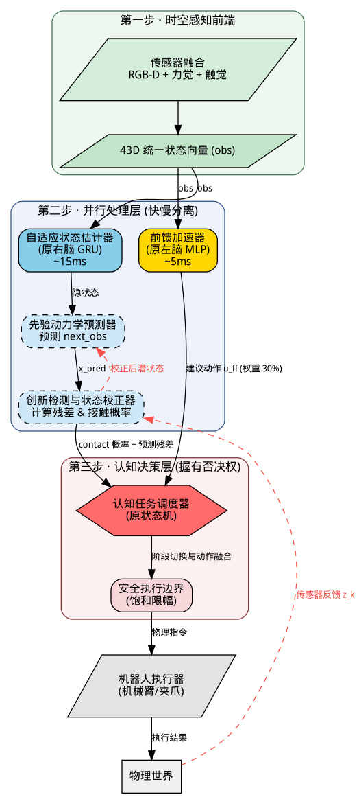
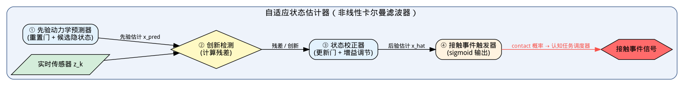

# Z-MAX 三脑架构 — 分层递阶控制 + 数据流闭环

> 2026-08-16 · 前馈加速器 / 自适应状态估计器 / 认知任务调度器
> 配套画布: `flows/ff_pd_top.json` 神经同构行（⚙️ 前馈 PD 顶层）

## 1. 系统顶层逻辑框图

**从左到右**: 输入 → 并行处理（快慢通道）→ 决策融合 → 输出 → 反馈校准。

| 层级 | 模块 | 原名称 | 角色 | 时耗 |
| :--- | :--- | :--- | :--- | :--- |
| 感知前端 | 传感器融合 | — | RGB-D + 力觉 + 触觉 → 43D 统一状态 | — |
| 快速通道 | **前馈加速器** | 左脑 MLP | 直连 43D 状态硬算, 产生建议动作 u_ff | ~5ms |
| 慢速通道 | **自适应状态估计器** | 右脑 GRU | 依赖循环和力觉反馈, 计算接触概率 | ~15ms |
| 认知决策 | **认知任务调度器** | 状态机 | 握有否决权: 阶段切换 + 动作融合 | — |
| 安全边界 | 饱和限幅 | 物理限幅 | 死区 + 饱和 = 非线性阻尼 | — |

**设计要点**:
- 决策权在调度器手中: 调度器**读取**前馈加速器的输出（建议动作 u_ff 权重 30%）, 不修改 MLP 权重
- 反馈回路标注为**预测误差（Prediction Error）**而非"误差梯度"——符合卡尔曼滤波语境, 与深度学习区分
- 快慢结合、安全兜底: 快速通道 5ms 响应, 慢速通道 15ms 校正, 调度器在两者间仲裁

## 2. 自适应状态估计器内部（非线性卡尔曼滤波语义）

| 卡尔曼组件 | 内部实现 | 输出 |
| :--- | :--- | :--- |
| ① 先验动力学预测器 | 重置门 + 候选隐状态 (GRU) | 先验估计 x_pred |
| ② 创新检测 | 残差计算: z_k − x_pred | 残差 / 创新 |
| ③ 状态校正器 | 更新门 + 增益调节 (≈卡尔曼增益 K) | 后验估计 x_hat |
| ④ 接触事件触发器 | sigmoid 输出 | contact 概率 → 认知任务调度器 |

## 3. 与神经科学映射

| 生物机制 | 工程实现 |
| :--- | :--- |
| 小脑 (前馈控制) | 前馈加速器 (左脑 MLP, 逆动力学模型) |
| 世界模型 (预测-更新) | 自适应状态估计器 (右脑 GRU ≈ 非线性卡尔曼) |
| 前额叶 (规划决策) | 认知任务调度器 (状态机) |
| 攀缘纤维 (误差信号) | 创新检测: 力传感器 vs 右脑预测对比 |
| 长时程抑制 LTD | gate 突触抑制 (1.0→0.1→0.01) |

## 4. 工程标定（不碰权重）

| 旋钮 | 位置 | 操作 |
| :--- | :--- | :--- |
| 感知零偏 x_mean/x_std | 前馈加速器 | 静止记录 obs → 校准零点 |
| 执行力 act_gain/err_gain | 前馈加速器 | 限位器: 重物体调小 err_gain |
| 置信度 α | α 融合层 | fused = (1−α)·预测 + α·观测 |
| 误差警戒 gate_th/gate_min | 攀缘纤维 | 误差超阈值 → gate 骤降压制 |

---
*源码: docs/diagrams/*.dot (Graphviz) + *.mmd (Mermaid, 用户原始方案)*
